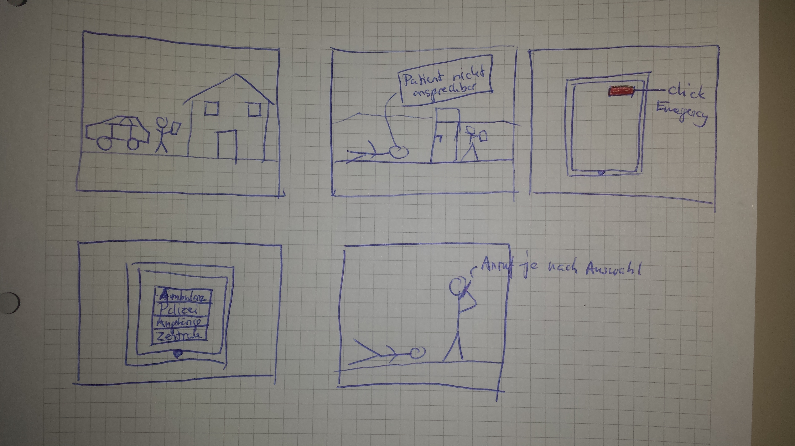
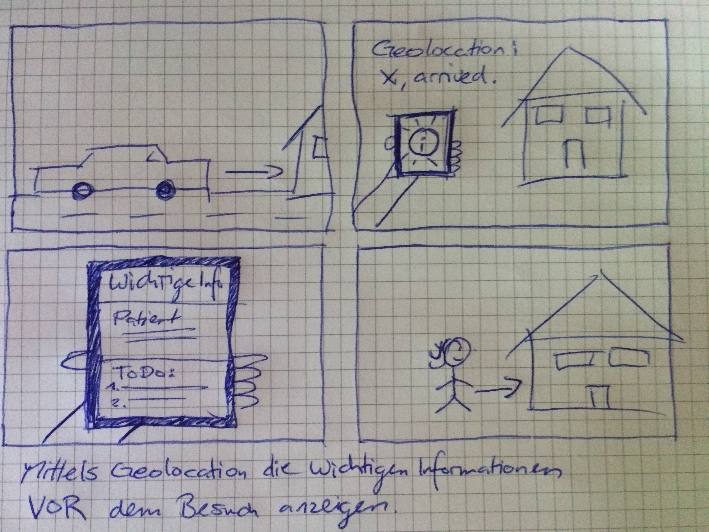
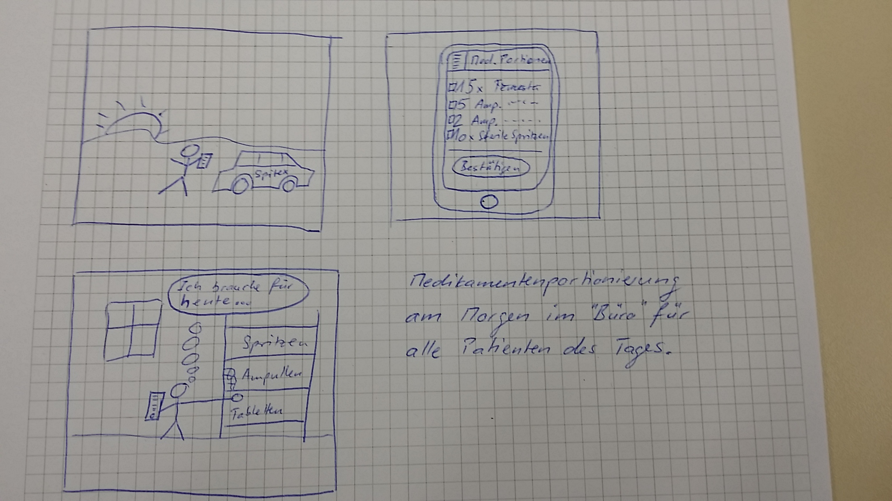
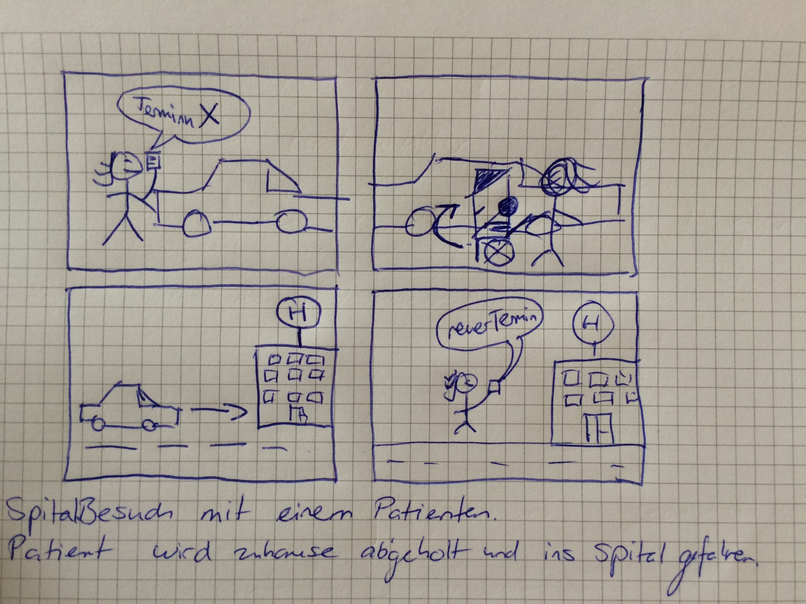
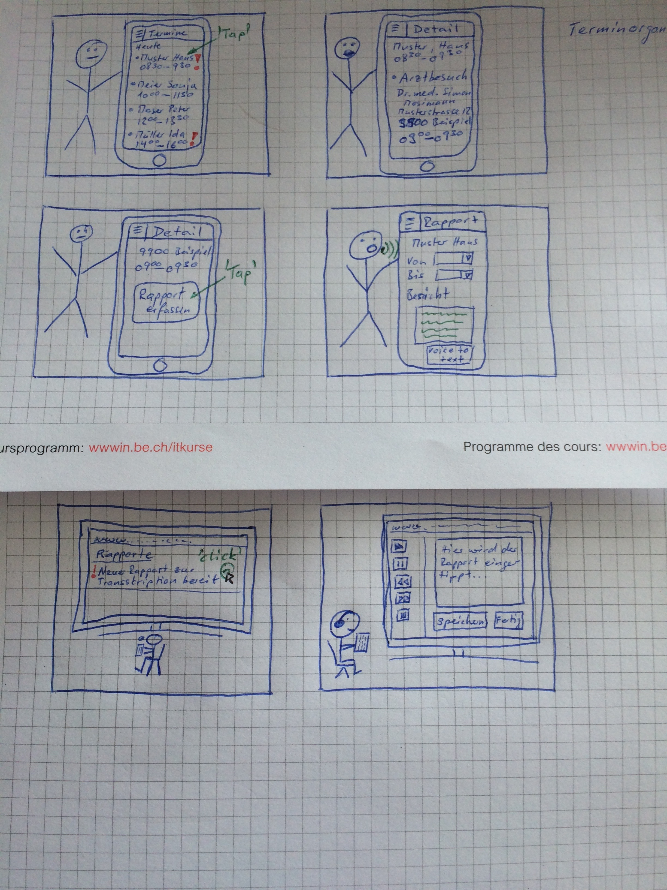
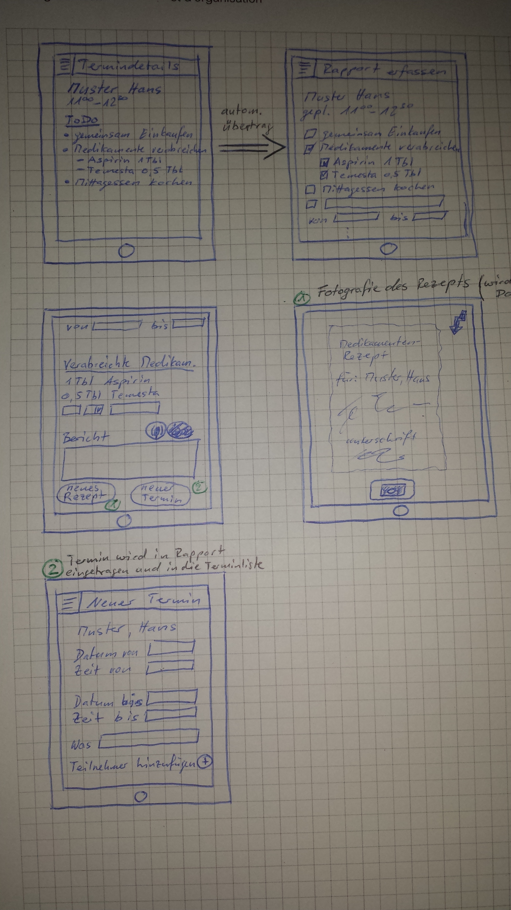

# Scope

## Allgemein

Der Healtvisitor besucht Patienten und verrichtet verschiedene Arbeiten im Zusammenhang mit der mentalen Störung des Patienten.

## Scope

- Hilfe bei Vorbereitung des Besuches
- Hilfe bei Dokumentation des Besuches

## Out-of-scope

- Terminplannung
- Komplette Krankengeschichte

## Success measures

- Besuch gut Dokumeniert
- Healthvisitors brauchen App
- Weniger Papier (Administrativer Aufwand)
- Besserer Austausch von Informationen zwischen Pflegepersonal

# Research

## Ziele des Besuchs

- Förderung der Selbstständigkeit
- Planung und Umsetzung von Aktivitäten
- Hilfe bei Behörden- und Arztgängen
- Unterstützung bei Einkäufen
- Erhalten von selbstständigem Wohnen (Verwahrlosung verhindern)
- Überwachung der Medikamentenabgabe
- Hilfestellung bei der Medikamenteneinnahme (Spritzen geben)
- Frühzeitige Erkennung von Krisen
- Sozialer Kontakt

## Organisationen

### Bern

- Spitex (Nur Medizinisches)
- Rotes Kreuz (Transport)
- Bellevie (Haushalt)

## Krankheitsbilder bei Patienten:

- ADHS
- Persönlichkeitsstörungen ( Borderline, Probleme mit Umgebung)
- Angststörungen
- Posttraumatische Belastungsstörungen
- Burnout
- Schizophrenie
- Demenz
- Sucht
- Krise
- Zwangsstörungen

# Synthesize

## Fragen

- Auch Coiffure Besuche?

## Ideen (Features)

- Navigation (Karte) zum nächsten Kunden
- Zeitrapport
- Medikamentenliste und Materialliste für Tag
- Medikamentliste und Materialliste für den Patienten
- Taskliste für Patienten-Besuch
- Taskliste (Termin) und Checkliste in Rapport automatisch übernommen (erweiterbar)
- Krankheitsgeschichte von Patienten
- Portrait (Überblick, wichtige Informationen) von Patienten
	- "Likes" und "Don't likes"
- Letzter Rapport (Sprachausgabe)
- Reminder
- Alerts über Notfälle
- Rapport per Spracheingabe (Voice Report)
- Sprachsteuerung
- Wichtige Hinweise zum Patienten
- Tracking über GPS -> Zeitmanagment automatisiert
- Alarmierungsfunktion bei Notfällen vor Ort
- ~~Für Patient, Fallerkennung über Mobile-App -> Notruf mit Rückfrage~~
- Mehrsprachig (nicht nur Landesprachen)
- Weisungshandbücher auf Abruf
- Terminbuchungen-/Anfragen (in Rapport)
- Medikamenterfassung (Autocomplete)
- Behandlungen aus vorgegebener Liste (Autocomplete)

# Design

## Storyboards

# Prototype

First Mockups available on:
https://moqups.com/t.fluehmann94@hotmail.com/VtHLS7Zw/

# Validation
