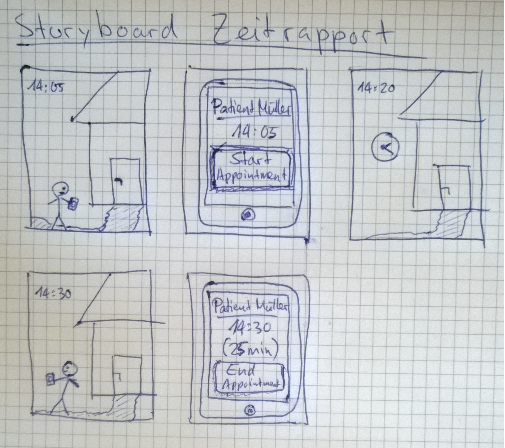
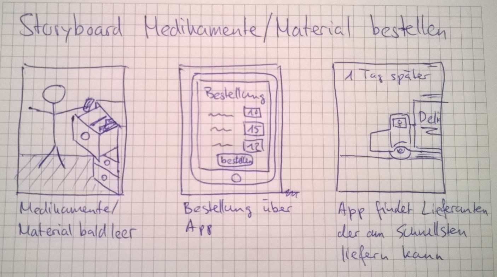
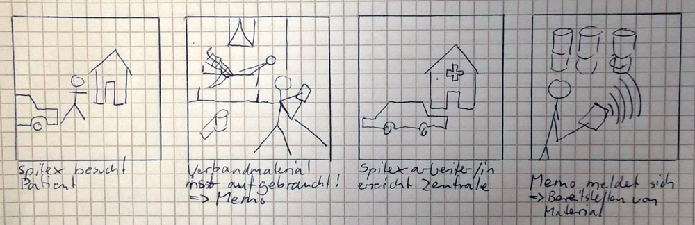
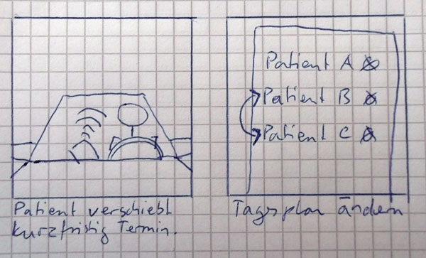
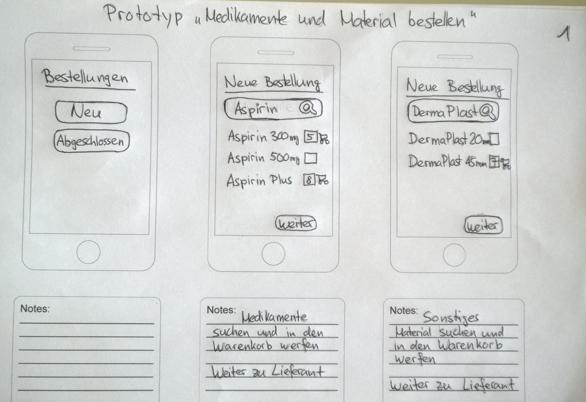
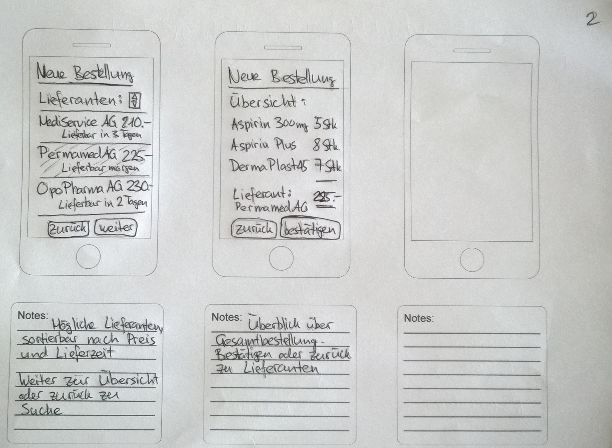

# Scope

## Allgemein

Der Healtvisitor besucht Patienten und verrichtet verschiedene Arbeiten im Zusammenhang mit der mentalen Störung des Patienten.

## Scope

- Hilfe bei Vorbereitung des Besuches
- Hilfe bei Dokumentation des Besuches

## Out-of-scope

- Terminplanung
- Komplette Krankengeschichte

## Success measures

- Besuch gut dokumeniert
- Health visitors brauchen App
- Weniger Papier (Reduktion des administrativen Aufwands)
- Besserer Austausch von Informationen zwischen Pflegepersonal

# Research

## Ziele des Besuchs

- F�rderung der Selbstst�ndigkeit
- Planung und Umsetzung von Aktivit�ten
- Hilfe bei Beh�rden- und Arztg�ngen
- Unterstützung bei Einkäufen
- Erhalten von selbstst�ndigem Wohnen (Verwahrlosung verhindern)
- �berwachung der Medikamentenabgabe
- Hilfestellung bei der Medikamenteneinnahme (Spritzen geben)
- Fr�hzeitige Erkennung von Krisen
- Sozialer Kontakt

## Organisationen

### Bern

- Spitex (nur medizinisches)
- Rotes Kreuz (Transport)
- Bellevie (Haushalt)

## Krankheitsbilder bei Patienten:

- ADHS
- Pers�nlichkeitsst�rungen (Borderline, Probleme mit Umgebung)
- Angstst�rungen
- Posttraumatische Belastungsst�rungen
- Burnout
- Schizophrenie
- Demenz
- Sucht
- Krise
- Zwangsst�rungen

#�Synthesize

## Fragen

- Auch Coiffure Besuche?

## Ideen (Features)

- Navigation (Karte) zum n�chsten Kunden
- Zeitrapport
- Medikamentenliste und Materialliste f�r Tag
- Medikamentliste und Materialliste f�r den Patienten
- Taskliste f�r Patienten-Besuch
- Taskliste (Termin) und Checkliste in Rapport automatisch �bernommen (erweiterbar)
- Krankheitsgeschichte von Patienten
- Portrait (�berblick, wichtige Informationen) von Patienten
	- "Likes" und "Don't likes"
- Letzter Rapport (Sprachausgabe)
- Reminder
- Alerts �ber Notf�lle
- Rapport per Spracheingabe (Voice Report)
- Sprachsteuerung
- Wichtige Hinweise zum Patienten
- Tracking �ber GPS -> Zeitmanagment automatisiert
- Alarmierungsfunktion bei Notf�llen vor Ort
- ~~F�r Patient, Fallerkennung �ber Mobile-App -> Notruf mit R�ckfrage~~
- Mehrsprachig (nicht nur Landesprachen)
- Weisungshandb�cher auf Abruf
- Terminbuchungen-/Anfragen (in Rapport)
- Medikamentenerfassung (Autocomplete)
- Behandlungen aus vorgegebener Liste (Autocomplete)
- Medikamente und Material bestellen
- Memo (Erinnerungsnotiz)

# Design

## Storyboards

# Prototype

First Mockups available on:
https://moqups.com/t.fluehmann94@hotmail.com/VtHLS7Zw/

# Validation

Mit den Informationen aus den Interviews konnten wir unsere Prototypen erheblich verbessern und wussten wo
momentan die "Pain-Points" für die Health Visitors sind.
[ Interviews ](../interviews9
